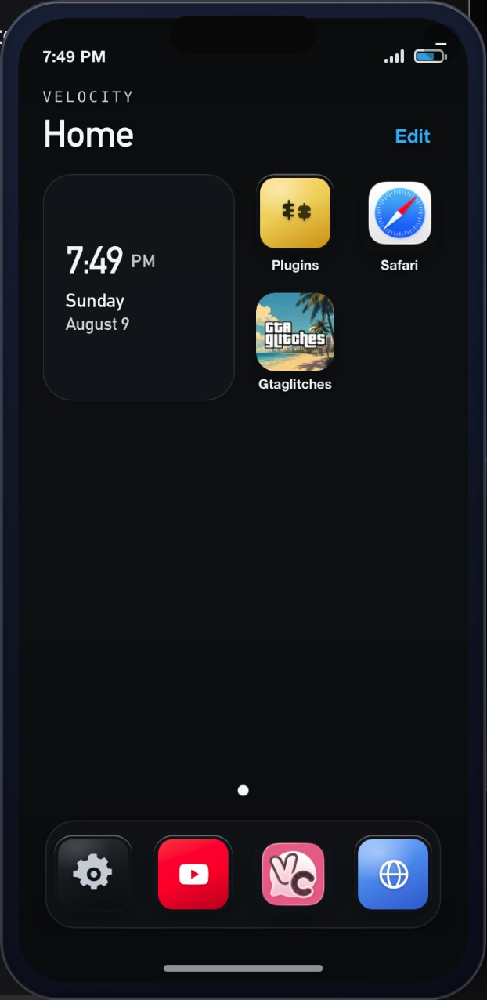
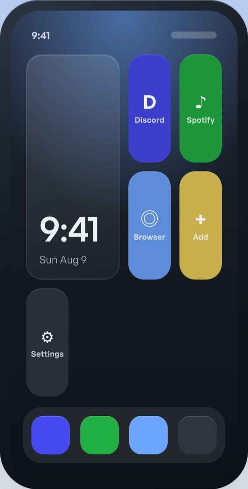

<p align="center">
  
</p>

<h1 align="center">Velocity</h1>

<p align="center">
  <strong>v0.1.1</strong><br>
  <a href="https://vty.dev">vty.dev</a> · open source by <a href="https://github.com/InertiaUX">Inertia</a>
</p>

<p align="center">
  Desktop phone companion for shortcuts and plugins.<br>
  Inspired by GTA’s in-game phone.
  <strong>Not affiliated with Rockstar Games or Take-Two Interactive.</strong>
</p>

## Why this exists

Inspired by GTA’s in-game phone: a floating home screen on your desktop for shortcuts, themes, and plugins. Hide and show it with a hotkey (default **Shift+Tab**).

It’s a natural fit for the FiveM community, and for livestreamers who want quick access to apps, tools, and links without a Stream Deck. Built with gamers in mind for quick multitasking mid-match or mid-stream. Launch Discord, Spotify, browsers, games, custom tiles, wallpaper packs, and whatever else you wire up.

## Screenshots

<p align="center">
  
  &nbsp;
  
</p>

## Support

| Platform | Get it |
|----------|--------|
| **macOS** (Apple Silicon) | [v0.1.1 arm64 zip](https://github.com/InertiaUX/Velocity/releases/download/v0.1.1/Velocity-0.1.1-macOS-arm64.zip) |
| **macOS** (Intel / universal) | Build: `ARCH=x86_64` or `ARCH=universal ./scripts/build-mac.sh` |
| **Windows / Linux** | Build: `./scripts/build-desktop.sh` |

Install: unzip → drag `Velocity.app` to Applications → open (right-click → Open if Gatekeeper blocks). Full notes: [docs/install.md](docs/install.md).

Site: [https://vty.dev](https://vty.dev) · Optional tip toward Mac signing: [vty.dev/#support](https://vty.dev/#support)

## Develop

Node 20+, Rust (stable), platform WebView.

```bash
git clone https://github.com/InertiaUX/Velocity.git
cd Velocity
npm install
./scripts/run-dev.sh
```

Controls: Shift+Tab hide/show · Esc back · optional keyboard control in Settings.

```bash
./scripts/build-mac.sh
./scripts/build-desktop.sh
npm run build:web
```

## Plugins

HTML tiles inside Velocity: [DEVELOPERS.md](DEVELOPERS.md) · [vty.dev/developers](https://vty.dev/developers.html)

Spotify example: create an app at the [Spotify Dashboard](https://developer.spotify.com/dashboard), redirect `http://127.0.0.1:18766/callback`, paste the **Client ID** in the tile (never commit a secret). Premium required for remote playback.

## Layout

```
apps/desktop/     Tauri 2 + React phone shell
apps/web/         Site (vty.dev)
packages/sdk/     @velocity/sdk
plugins/          Example plugins
docs/             Install, architecture, screenshots
scripts/          Dev / build helpers
```

## Updates

Settings → Updates checks an HTTPS JSON feed. Example: [docs/update-feed.example.json](docs/update-feed.example.json).

## License

| Part | Terms |
|------|-------|
| Shell, SDK, plugins, docs, site | [MIT](LICENSE) |
| Rockstar / GTA marks | Not ours. See [NOTICE](NOTICE) |
| Third-party APIs | Their terms; bring your own credentials |

[CONTRIBUTING.md](CONTRIBUTING.md) · [SECURITY.md](SECURITY.md)
